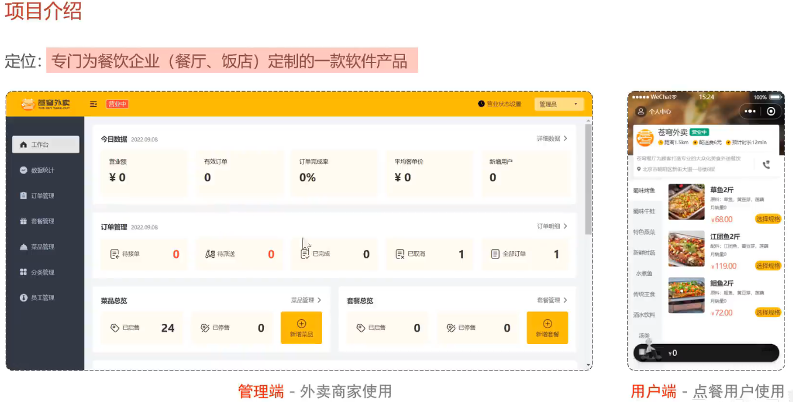
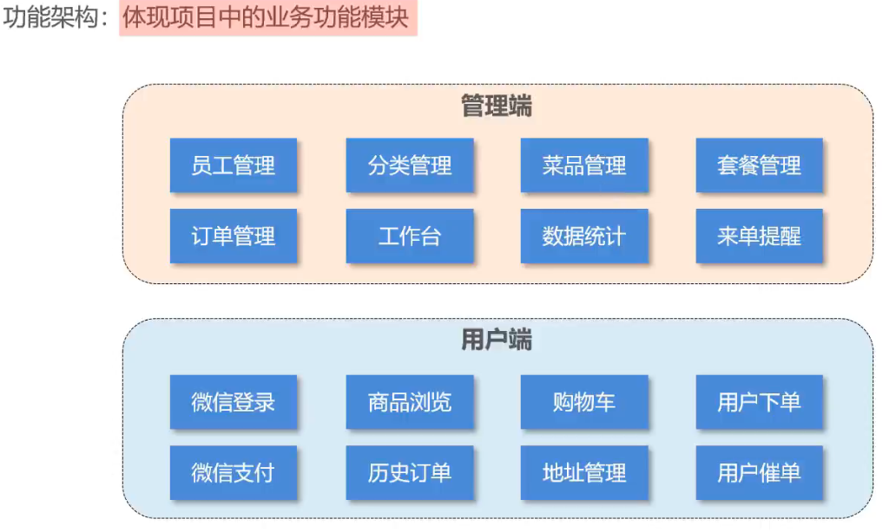
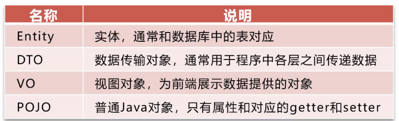

## Introuduction





### 数据交换过程的对象



1.DTO
        Data Transfer Object：数据传输对象，DTO用于在不同层之间传输数据，它通常用于将业务逻辑层（Service层）的数据传输给表示层（Presentation层）或持久化层（Persistence层）。DTO对象通常包含业务领域的数据，但不包含业务逻辑。

2.dao
        Data Access Objects：数据访问对象,DAO用于封装数据访问逻辑，它负责与数据库进行交互，执行CRUD（创建、读取、更新、删除）操作。DAO对象通常封装了数据库访问的细节，使业务逻辑层能够更加简洁地操作数据。

3.vo
        Value Object：值对象，VO也是用于数据传输的对象，类似于DTO，但VO通常更加专注于视图层的数据展示。VO对象通常包含了在前端页面展示所需的数据。屏蔽掉密码、创建时间、状态等敏感信息

4.bo
        Business Object：业务对象层，BO用于封装业务逻辑，它通常包含了一系列的业务方法，用于实现业务规则和业务流程。BO对象通常会调用DAO对象来实现数据的持久化和访问。

5.do
Domain Object： 领域对象，通常用于表示业务领域中的实体或业务对象。DO对象通常包含了业务逻辑和数据，是业务逻辑的实体表示。在某些情况下，DO对象可能与PO对象相似，但它们的用途和含义不同。DO对象通常用于表示业务领域中的复杂业务逻辑和业务实体。

6.po
        Persistant Object ：持久对象，通常用于表示与数据库中的表（或文档）相映射的Java对象。PO对象的属性对应数据库表的字段，每个PO对象通常表示数据库中的一条记录。PO对象通常用于ORM（对象关系映射）框架中，如Hibernate、MyBatis等。

管理端发出的请求，统一使用/admin作为前缀
用户端发出的请求，统一使用/user作为前缀

## 项目难点
### SwaggerGo 的使用
swagger是一套基于OpenAPI规范构建的开源工具，使用RestApi，但是在golang生态中仍然使用的是1.6版本。相比于Spring中的3.0版本要维护的更慢
因此对于项目的兼容性是一个需要考虑的难题，这体现在接口文档注释中的各项注解
```go
// @AddEmployee 注册员工接口
// @Security JWTAuth
// @Tags Employee
// @Produce json
// @Param data body request.EmployeeDTO true "新增员工信息"
// @Success 200 {object} common.Result{} "success"
// @Router /admin/employee/ [post]
func (ec *EmployeeController) AddEmployee(ctx *gin.Context) {
        var (
                code     = e.SUCCESS
                err      error
                employee request.EmployeeDTO
        )
        err = ctx.ShouldBindWith(&employee, binding.JSON)
        if err != nil {
                global.Log.Debug("AddEmployee Error:", err.Error())
                return
        }

	err = ec.service.CreateEmployee(ctx, employee)
	if err != nil {
		code = e.ERROR
		global.Log.Warn("AddEmployee  Error:", err.Error())
		ctx.JSON(http.StatusOK, common.Result{
			Code: code,
			Msg:  err.Error(),
		})
	}

	ctx.JSON(http.StatusOK, common.Result{
		Code: code,
	})
}
```
错误的参数名称如`Param`和`Params`会导致swagger识别不出来
而Http请求的头部Token的设置对于接口调试也很重要，设置统一Token需要参考https://github.com/swaggo/gin-swagger/issues/90
